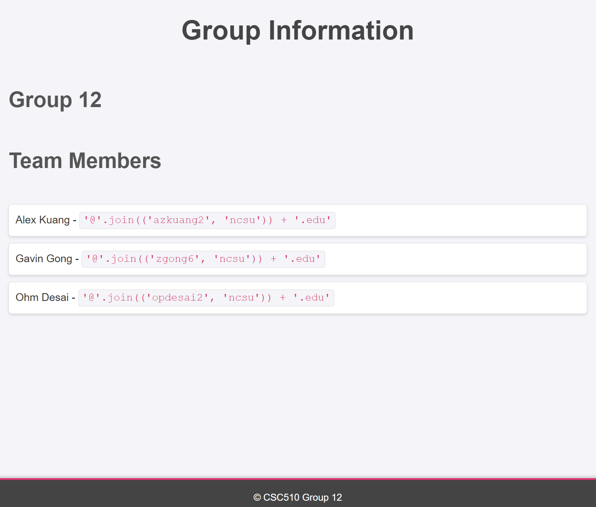
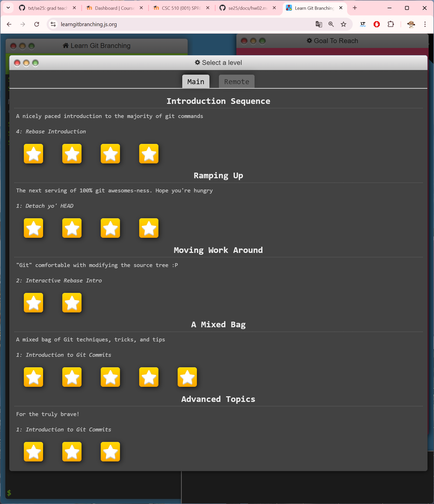

# Homework 2: Git Tutorial

## 📝 Introduction


## 2️⃣ Image

Index HTML:


Git toturial progress:



## 3️⃣ Code Example

```bash
# clone this repository
$ git clone ... (URL)

# create a new branch for yourself, should use unityid as branch name
$ git checkout -b <your_unity_id>

# make changes to the code
...

# add the changes to the staging area
$ git add .

# commit the changes
$ git commit -m "commit message"

# push the changes to the remote repository on your branch
$ git push origin <your_unity_id>
```

After that, you can create a pull request to merge your changes into the main branch.

# Task List

- [x] Task 1: Complete Git Tutorial
- [x] Task 2: Add Screenshots to README.md
- [x] Task 3: Modify .html File
- [ ] Task 4: Merge latest changes
- [x] Task 5: Review pull request
